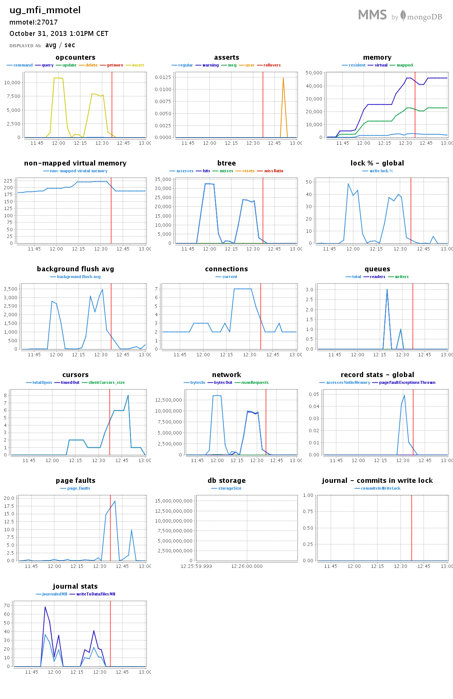
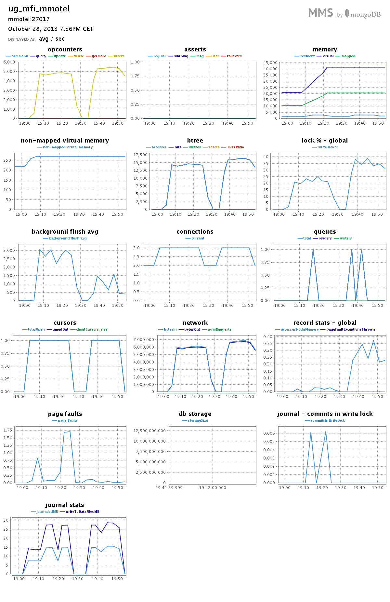

#Zadanie 1c

##Treść

Zadanie 1c. (Zamiana formatu danych.) Zamienić string zawierający tagi na tablicę napisów z tagami następnie zliczyć wszystkie tagi i wszystkie różne tagi. Napisać program, który to zrobi korzystając z jednego ze sterowników. Lista sterowników jest na stronie [MongoDB Ecosystem](http://docs.mongodb.org/ecosystem/).

##Rozwiązanie `powłoka Mongo`

Do rozwiązania zadania użyłem skryptu `JavaScript` uruchamianego na powłoce `Mongo`.

##Rozwiązanie `Node.JS`

Do rozwiązania zadania użyłem skryptu `JavaScript` uruchamianego na serwerze [`Node.JS`](http://nodejs.org/) w wersji `0.10.21`, który korzysta ze sterownika [`The Node.JS MongoDB Driver`](http://mongodb.github.io/node-mongodb-native/) w wersji `1.3.19`.


##Zamiana ciągu napisów na tablicę napisów

Sprawdzamy jakiego typu jest pole `Tags` każdego elemenu kolekcji `train`. Następnie używamy metodę `split()` aby rozdzielić ciag napisów do tablicy lub dodajemy zawartość innego typu (np. liczbowego) do tablicy.

```js
if(item.Tags.constructor !== Array){  
  var tagsSplited = []; //tablica na rozdzielone tagi

  if(item.Tags.constructor === String){
    var tagsSplited = item.Tags.split(" ");
  } else {
    tagsSplited.push(item.Tags);
  }
}
```

##Wyniki


###scrpit.js (Node.js)

```sh
time node script.js
```

```sh
MongoDB Połączono!
...
obiektów: 6030000 aktualizacji: 6030000 tagów: 17397682 różnych tagów: 42047
#@$% Wykonano 6030000 aktualizacji.
#@$% Wykonano 6034195 aktualizacji.
Update-y zakończone.
MongoDB Rozłączone!
ilość obiektów: 6034195
ilość updateów: 6034195
   ilość tagów: 17409994
 różnych tagów: 42048
```

####Sprawdzenie

Element po wykonaniu aktualizacji:

```js
> db.train2.findOne()
```

```json
{
  "_id" : ObjectId("527236d49bf8f201b1bd461e"),
  "Id" : 1,
  "Title" : "How to check if an uploaded file is an image without mime type?",
  "Body" : "<p>I'd like to check if an uploaded file is an image file (e.g png, jpg, jpeg, gif, bmp) or another file. The problem is that I'm using Uploadify to upload the files, which changes the mime type and gives a 'text/octal' or something as the mime type, no matter which file type you upload.</p>  <p>Is there a way to check if the uploaded file is an image apart from checking the file extension using PHP?</p> ",
  "Tags" : [
    "php",
    "image-processing",
    "file-upload",
    "upload",
    "mime-types"
  ]
}

```

####Czasy

```sh
real  13m1.030s
user  5m31.832s
sys   0m10.816s
```

W ciągu `13m1.030s` wykonano `6 034 195` aktualizacji. Co średnio daje `~7 726` aktualizacji na sekundę.

###mongoScript.js

```sh
time mongo train mongoScript.js 
```

```sh
MongoDB shell version: 2.4.7
connecting to: train
     obiektów: 6034195
 aktualizacji: 6034195
        tagów: 17409994
różnych tagów: 42048
```

####Sprawdzenie

Element po wykonaniu aktualizacji:

```json
{
  "_id" : ObjectId("526e9eea0d0994b3ea766bc5"),
  "Id" : 1,
  "Title" : "How to check if an uploaded file is an image without mime type?",
  "Body" : "<p>I'd like to check if an uploaded file is an image file (e.g png, jpg, jpeg, gif, bmp) 
  or another file. The   problem is that I'm using Uploadify to upload the files, which changes the 
  mime type and gives a 'text/octal' or    something as the mime type, no matter which file type you 
  upload.</p>  <p>Is there a way to check if the uploaded file    is an image apart from checking the 
  file extension using PHP?</p> ",
  "Tags" : [
    "php",
    "image-processing",
    "file-upload",
    "upload",
    "mime-types"
  ]
}
```
####Czasy

```sh
real  18m46.243s
user  11m35.016s
sys   0m14.732s
```

W ciągu `18m46.243s` wykonano `6 034 195` aktualizacji. Co średnio daje `~5 358` aktualizacji na sekundę.

##Wyniki z MongoDB Management Service

####script.js

`**` Czerwona linia oznacza wykonanie restartu bazy danych.



####mongoScript.js



Dziękuję. Dobranoc.
