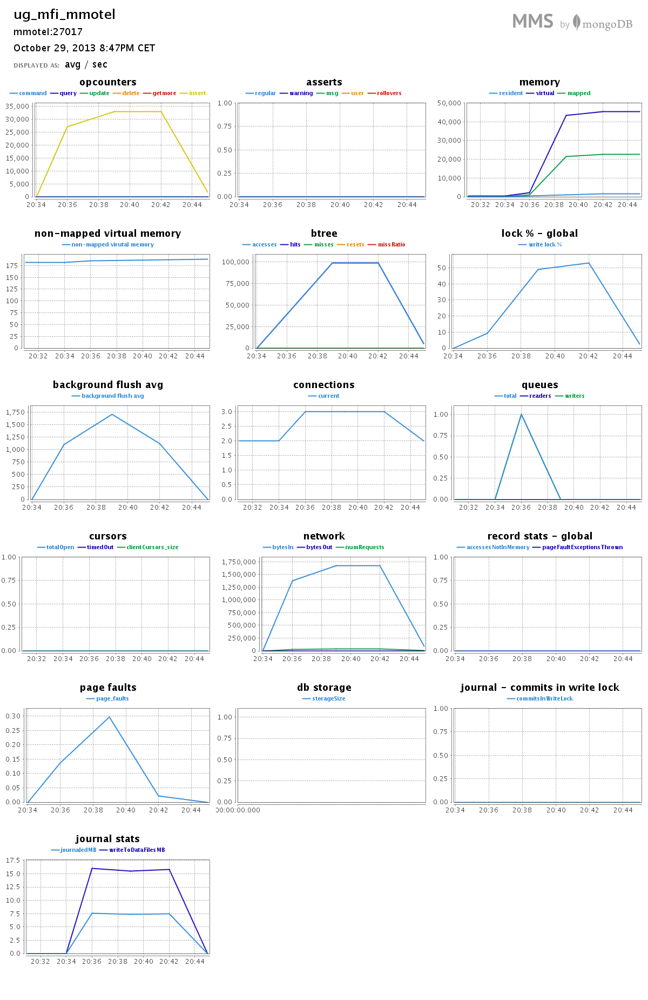
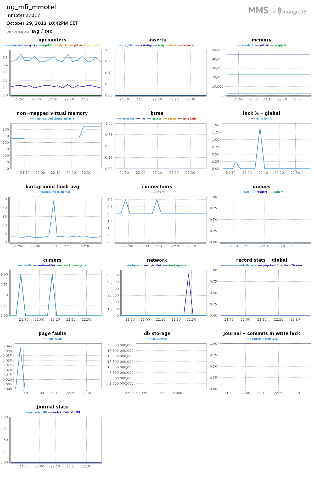

#Zadanie 1d

###Treść

Zadanie 1d. Ściągnąć plik `text8.zip` ze strony [Matt Mahoney](http://mattmahoney.net/dc/textdata.html) (po rozpakowaniu 100MB):

```sh
wget http://mattmahoney.net/dc/text8.zip -O text8.gz
```

Zapisać wszystkie słowa w bazie MongoDB. Następnie zliczyć liczbę słów oraz liczbę różnych słów w tym pliku. Ile procent całego pliku stanowi:

 * najczęściej występujące słowo w tym pliku
 * 10, 100, 1000 najczęściej występujących słów w tym pliku

Wskazówka: Zaczynamy od prostego `EDA`. Sprawdzamy, czy plik `text8` zawiera wyłącznie znaki alfanumeryczne i białe:

```sh
tr --delete '[:alnum:][:blank:]' < text8 > deleted.txt
ls -l deleted.txt
  -rw-rw-r--. 1 wbzyl wbzyl 0 10-16 12:58 deleted.txt # rozmiar 0 -> OK
rm deleted.txt
```

Dopiero teraz wykonujemy te polecenia:

```sh
wc text8
  0         17005207 100000000 text8
tr --squeeze-repeats '[:blank:]' '\n' < text8 > text8.txt
wc text8.txt
  17005207  17005207 100000000 text8.txt  # powtórzone 17005207 -> OK
```

##Rozwiązanie

Do rozwiązania zadania użyłem skryptu `JavaScript` uruchamianego na powłoce `Mongo`.

##Import

Po przygotowaniu pliku `text8.txt` zgodnie ze `wskazówką` (patrz treść zadania), importujemy słowa do bazy danych jednocześnie mierząc czas:

```sh
time mongoimport -d text -c text --type csv --fields 'word' --file text8.txt 
```

###Wynik

```sh
connected to: 127.0.0.1
Tue Oct 29 20:34:16.304     Progress: 557689/100000000  0%
Tue Oct 29 20:34:16.304       92600 30866/second
...
Tue Oct 29 20:42:47.037     Progress: 99670107/100000000  99%
Tue Oct 29 20:42:47.037       16950000  32976/second
Tue Oct 29 20:42:48.382 check 9 17005207
Tue Oct 29 20:42:49.272 imported 17005207 objects
```

###Czasy

```sh
real  8m36.433s
user  0m56.236s
sys   0m11.976s
```

W ciągu `8m16.833s` zaimportowano `17 005 207` słów. Co średnio daje `~32 955` insertów do bazy na sekundę.

###Sprawdzenie

```js
mongo
MongoDB shell version: 2.4.7
connecting to: test
> use text
switched to db text
> db.text.count()
17005207
```

###Wyniki z MongoDB Management Service



##Zliczanie słów

####Agregacja

Do zliczania słów użyjemy prostej `agregacji`:

```js
coll.aggregate(
  { $group: {_id: "$word", count: {$sum: 1}} },
  { $sort: {count: -1} },
  { $limit: 1 } //lub 10, 100, 1000
)
```

Ustawiając lub wykomentowując `$limit` ustalamy ilość elementów, które otrzymamy w wyniku agregacji.

####Różnych słów

```sh
MongoDB shell version: 2.4.7
connecting to: text
 słów: 253854
ilość: 17005207
część: 100%
```

Czasy:

```sh
real  0m18.030s
user  0m1.340s
sys   0m0.124s
```

####1 słowo

```sh
MongoDB shell version: 2.4.7
connecting to: text
```

```json
{ "result" : [ { "_id" : "the", "count" : 1061396 } ], "ok" : 1 }
```

```sh
 słów: 1
ilość: 1061396
część: 6.241594118789616%
```

Czasy:

```sh
real  0m15.979s
user  0m0.048s
sys   0m0.012s
```

####10 słów

```sh
MongoDB shell version: 2.4.7
connecting to: text
```

```json
{
  "result" : [
    { "_id" : "the",  "count" : 1061396 },
    { "_id" : "of",   "count" : 593677  },
    { "_id" : "and",  "count" : 416629  },
    { "_id" : "one",  "count" : 411764  },
    { "_id" : "in",   "count" : 372201  },
    { "_id" : "a",    "count" : 325873  },
    { "_id" : "to",   "count" : 316376  },
    { "_id" : "zero", "count" : 264975  },
    { "_id" : "nine", "count" : 250430  },
    { "_id" : "two",  "count" : 192644  }
  ],
  "ok" : 1
}
```

```sh
 słów: 10
ilość: 4205965
część: 24.733394894869555%
```

Czasy:

```sh
real  0m16.088s
user  0m0.056s
sys   0m0.008s
```
####100 słów

```sh
MongoDB shell version: 2.4.7
connecting to: text
```

```json
{
  "result" : [
    { "_id" : "the",     "count" : 1061396 },
    { "_id" : "of",      "count" : 593677  },
    { "_id" : "and",     "count" : 416629  },
    { "_id" : "one",     "count" : 411764  },
    { "_id" : "in",      "count" : 372201  },
    //...
    { "_id" : "history", "count" : 12623   },
    { "_id" : "will",    "count" : 12560   },
    { "_id" : "up",      "count" : 12445   },
    { "_id" : "while",   "count" : 12363   },
    { "_id" : "where",   "count" : 12347   }
  ],
  "ok" : 1
}
```

```sh
 słów: 100
ilość: 7998978
część: 47.03840417820259%
```

Czasy:

```sh
real  0m16.055s
user  0m0.056s
sys   0m0.016s
```

####1000 słów

```sh
MongoDB shell version: 2.4.7
connecting to: text
```

```json
{
  "result" : [
    { "_id" : "the",     "count" : 1061396 },
    { "_id" : "of",      "count" : 593677  },
    { "_id" : "and",     "count" : 416629  },
    { "_id" : "one",     "count" : 411764  },
    { "_id" : "in",      "count" : 372201  },
    //...
    { "_id" : "child",   "count" : 1789    },
    { "_id" : "element", "count" : 1787    },
    { "_id" : "appears", "count" : 1786    },
    { "_id" : "takes",   "count" : 1783    },
    { "_id" : "fall",    "count" : 1783    }
  ],
  "ok" : 1
}
```

```sh
 słów: 1000
ilość: 11433354
część: 67.23443001899359%
```

Czasy:

```sh
real  0m16.109s
user  0m0.112s
sys   0m0.008s
```
##Wyniki z MongoDB Management Service



Dziękuję. Dobranoc.