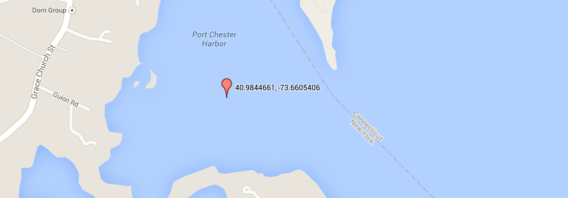
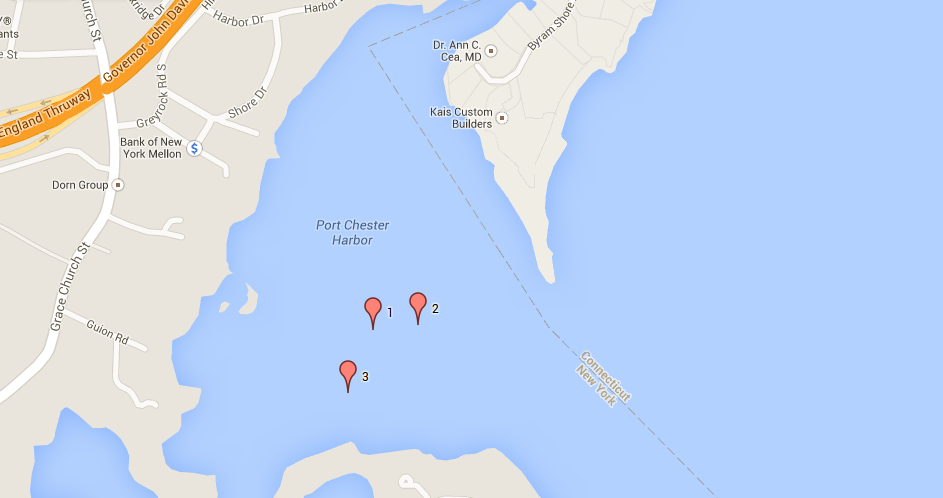
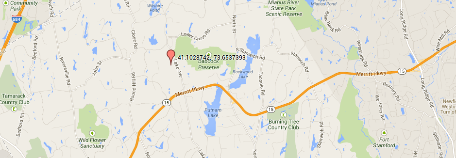
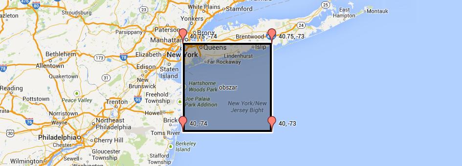
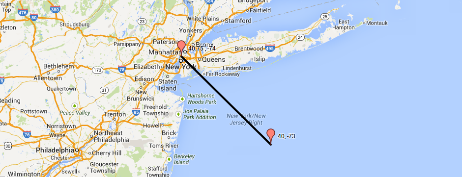
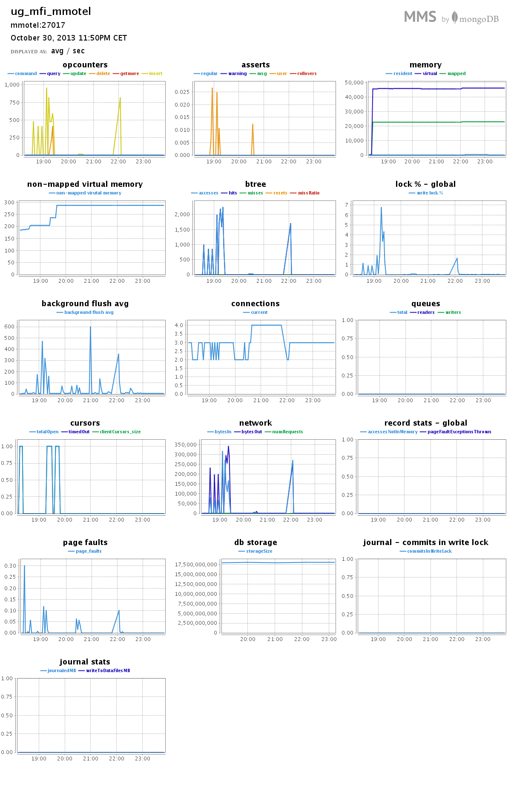
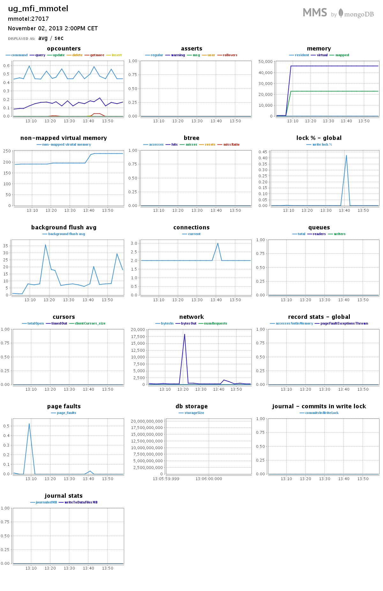

#Zadanie 1e

##Treść

Zadanie 1e. Wyszukać w sieci dane zawierające obiekty [`GeoJSON`](http://geojson.org/geojson-spec.html#examples). Zapisać dane w bazie `MongoDB`.

Dla zapisanych danych przygotować 6–9 różnych [`Geospatial Queries`](http://docs.mongodb.org/manual/applications/geospatial-indexes/) (co najmniej po jednym dla obiektów `Point`, `LineString` i `Polygon`). W przykładach należy użyć każdego z tych operatorów: `$geoWithin`, `$geoIntersect`, `$near`.

##Dane

Do rozwiązania zadania użyłem danych ze strony [`U.S. Geological Survey`](http://www.usgs.gov/) z działu [`United States Board on Geographic Names`](http://geonames.usgs.gov/) pt. [`Domestic and Antarctic Names`](http://geonames.usgs.gov/domestic/download_data.htm) dla stanu `Nowy Jork`.

Źródło danych: [link](http://geonames.usgs.gov/docs/stategaz/NY_Features_20131020.zip)

####Format pliku

Plik zawiera wartości oddzielone znakiem `|`. Linia z nagłówkami:

```
FEATURE_ID|FEATURE_NAME|FEATURE_CLASS|STATE_ALPHA|STATE_NUMERIC|COUNTY_NAME|COUNTY_NUMERIC|PRIMARY_LAT_DMS|PRIM_LONG_
DMS|PRIM_LAT_DEC|PRIM_LONG_DEC|SOURCE_LAT_DMS|SOURCE_LONG_DMS|SOURCE_LAT_DEC|SOURCE_LONG_DEC|ELEV_IN_M|ELEV_IN_FT|MAP_
NAME|DATE_CREATED|DATE_EDITED
``` 

Przykładowa linia z danymi:

```
205110|Appalachian National Scenic Trail|Trail|PA|42|Perry|099|401920N|0770439W|40.3221113|-77.0775473|||||200|656|
Wertzville|09/12/1979|01/03/2010
```

##EDA

###Przygotowanie danych

####Poprawienie pliku

Przerabiamy plik do formatu `.csv`. Aby to zrobić musimy jedynie zamienić `|` na `,`.

```sh
cat NY_Features_20131020.txt | tr "|" "," > NY_Prepared.txt
```

####Import 

```sh
time mongoimport -d geony -c ny --type csv --headerline --file NY_Prepared.txt
```

####Wynik

```sh
connected to: 127.0.0.1
Wed Oct 30 18:11:43.003     Progress: 5484351/10467976  52%
Wed Oct 30 18:11:43.003       40900 13633/second
Wed Oct 30 18:11:44.412 check 9 77132
Wed Oct 30 18:11:44.538 imported 77131 objects
```

####Czasy

```sh
real  0m4.324s
user  0m1.392s
sys 0m0.144s
```

###Robimy geoJSONy

Do przygotowania obiektów `geoJSON` użyjemy prostego skryptu powłoki `Mongo`, który z pól: `FEATURE_ID` ,`FEATURE_NAME` ,`PRIM_LONG_DEC` ,`PRIM_LAT_DEC` utworzy obiekty o takiej strukturze:

```json
{
  "id": FEATURE_ID,
  "name": FEATURE_NAME,
  "loc": { "type":"Point", "coordinates": [ PRIM_LONG_DEC , PRIM_LAT_DEC ] }
}
```

`**` Skrypt usuwa niepoprawne obiekty geoJSON z kolekcji `ny`. Jest ich `16`.

Uruchamiamy skrypt:

```sh
time mongo geony script.js > make-geo-points-results.txt 
```

####Czasy

```sh
real  0m7.311s
user  0m6.484s
sys 0m0.772s
```

####Dodajemy indeks:

```js
db.geony.ensureIndex({"loc" : "2dsphere"});
```

##Zapytania

###Przykład 1: $near

Wybrany punkt:

```json
{ 
  "_id" : ObjectId("527173ea5ac806a1e7c896ca"), 
  "id" : 209943, 
  "name" : "Port Chester Harbor", 
  "loc" : { 
    "type" : "Point", 
    "coordinates" : [ -73.6605406,  40.9844661 ] 
  } 
}
```

Port Chester Harbor w Google Maps: [link](http://goo.gl/maps/V2i7z)



```js
var punkt = { 
  "type" : "Point", 
  "coordinates" : [ -73.6605406,  40.9844661 ] 
};

db.geony.find({ loc: {$near: {$geometry: punkt}, $maxDistance: 200} }).toArray()
```

####Wynik

```json
[
  {
    "_id" : ObjectId("527173ea5ac806a1e7c896ca"),
    "id" : 209943,
    "name" : "Port Chester Harbor",
    "loc" : {
      "type" : "Point",
      "coordinates" : [ -73.6605406, 40.9844661 ]
    }
  },
  {
    "_id" : ObjectId("527173ed5ac806a1e7c91ee6"),
    "id" : 977443,
    "name" : "Manursing Island Reef",
    "loc" : {
      "type" : "Point",
      "coordinates" : [ -73.6595721, 40.9845422 ]
    }
  },
  {
    "_id" : ObjectId("527173ed5ac806a1e7c91eb4"),
    "id" : 977393,
    "name" : "Port Chester Harbor",
    "loc" : {
      "type" : "Point",
      "coordinates" : [ -73.6610683, 40.9834385 ]
    }
  }
]
```

####Wynik na Google Maps

`1` - Port Chester Harbor (wybrany punkt), `2` - Manursing Island Reef, `3` - Port Chester Harbor ("id" : 977393).



###Przykład 2.1: $geoWithin

####Wybrany punkt

```json
{ 
  "_id" : ObjectId("527173ea5ac806a1e7c896d9"), 
  "id" : 212165, 
  "name" : "Wilshire Pond Brook", 
  "loc" : { 
    "type" : "Point", 
    "coordinates" : [  -73.6537393,  41.1028742 ] 
  } 
}
```


Wilshire Pond Brook na Google Maps: [link](http://goo.gl/maps/MUJ16)



####Zapytanie

```js
db.geony.find({
  loc: {$geoWithin : { $center : [ [ -73.6537393,  41.1028742 ] , 0.1 ] } } 
}).toArray();
```

####Wynik

```js
182 //ilość obiektów
```

```json
[
  {
    "_id" : ObjectId("5274e857883c9f1a74854351"),
    "id" : 206430,
    "name" : "Converse Lake",
    "loc" : {
      "type" : "Point",
      "coordinates" : [ -73.6520811, 41.1326454 ]
    }
  },
  //...
  {
    "_id" : ObjectId("5274e85e883c9f1a7486695e"),
    "id" : 2716089,
    "name" : "Banksville Independent Fire Company",
    "loc" : {
      "type" : "Point",
      "coordinates" : [ -73.6424369, 41.1449055 ]
    }
  }
]
```

###Przykład 2.2: $near

####Wyrabny punkty (ten sam jak w przykładzie 2.1)

```js
var punkt = { 
  "type" : "Point", 
  "coordinates" : [  -73.6537393,  41.1028742 ] 
};
```

####Zapytanie

```js
db.geony.find({ loc: {$near: {$geometry: punkt}, $maxDistance: 10000 } }).toArray();
```

####Wynik

```js
176 //ilość obiektów
```

```json
[
  {
    "_id" : ObjectId("5274e85a883c9f1a7485b432"),
    "id" : 971407,
    "name" : "Wilshire Pond Brook",
    "loc" : {
      "type" : "Point",
      "coordinates" : [ -73.6537393, 41.1028742 ]
    }
  },
  //...
  {
    "_id" : ObjectId("5274e85b883c9f1a7485fcf0"),
    "id" : 2125385,
    "name" : "Brace Memorial School (historical)",
    "loc" : {
      "type" : "Point",
      "coordinates" : [ -73.7725, 41.0980556 ]
    }
  }
]
```

###Przykład 3.1: $geoWithin 

####Wybrany obszar

```js
var obszar = { 
    "type" : "Polygon", 
    "coordinates" : 
    [ [ 
        [ -74 , 40.75 ], 
        [ -73 , 40.75 ], 
        [ -73 , 40    ], 
        [ -74 , 40    ], 
        [ -74 , 40.75 ] 
    ] ]
};
```

Obszar na Google Maps:



####Zapytanie

```js
db.geony.find({ loc : { $geoWithin : { $geometry : obszar } } }).toArray();
```

####Wynik

```js
7343 //ilość obiektów
```

```json
[
  {
    "_id" : ObjectId("5274e858883c9f1a74854530"),
    "id" : 942423,
    "name" : "Ambrose Channel",
    "loc" : {
      "type" : "Point",
      "coordinates" : [ -73.922195, 40.488215 ]
    }
  },
  //...
  {
    "_id" : ObjectId("5274e85b883c9f1a7485ff64"),
    "id" : 2358931,
    "name" : "Gilgo Life Saving Station (historical)",
    "loc" : {
      "type" : "Point",
      "coordinates" : [ -73.3736111, 40.6213889 ]
    }
  }
]
```

###Przykład 3.2: $geoIntersects

####Wybrany obszar (taki sam jak w przykładzie 3.1)

```js
var obszar = { 
    "type" : "Polygon", 
    "coordinates" : 
    [ [ 
        [ -74 , 40.75 ], 
        [ -73 , 40.75 ], 
        [ -73 , 40    ], 
        [ -74 , 40    ], 
        [ -74 , 40.75 ] 
    ] ]
};
```

####Zapytanie

```js
db.geony.find({ loc : { $geoIntersects : { $geometry : obszar } } }).toArray();
```

####Wynik

```js
7343 //ilość obiektów
```

```json
[
  {
    "_id" : ObjectId("5274e858883c9f1a74854530"),
    "id" : 942423,
    "name" : "Ambrose Channel",
    "loc" : {
      "type" : "Point",
      "coordinates" : [ -73.922195, 40.488215 ]
    }
  },
  //...
  {
    "_id" : ObjectId("5274e85b883c9f1a7485ff64"),
    "id" : 2358931,
    "name" : "Gilgo Life Saving Station (historical)",
    "loc" : {
      "type" : "Point",
      "coordinates" : [ -73.3736111, 40.6213889 ]
    }
  }
]
```

###Przykład 4: $geoIntersects

####Wybrana linia

```js
var linia = { 
  "type": "LineString", 
  "coordinates": 
    [
      [ -73 , 40 ] , [ -74 , 40.75 ]
    ]
};
```

Wybrana linia na Google Maps:



####Zapytanie

```js
db.geony.find({ loc : { $geoIntersects : { $geometry : linia } } }).toArray();
```

####Wynik

```js
0 //ilość obiektów
```

```json
[ ]
```

##Wyniki z MongoDB Management Service





Dziękuję. Dobranoc.
